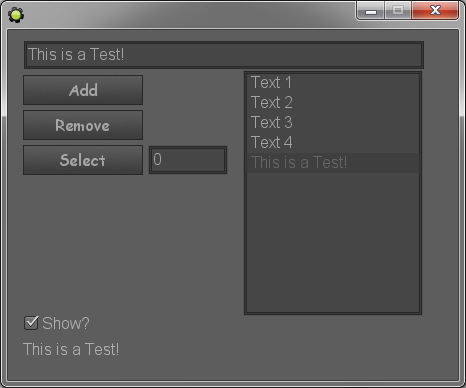

GMUI-Kit
========

Interface control components for Game Maker(http://yoyogames.com/)

 
<b>License:</b> GPL v3.0 (http://www.gnu.org/licenses/gpl-3.0.html)

How To Use?
===========
1. Run GM8.1/GM:S
2. go to: File > Import Resources... > SELECT "GMUI-Kit.gmres" > Open.
3. Check "Place new resources in new group".
4. Click on "OK".
5. go to "Objects" directory and Copy how many control u need.
6. Use and Enjoy.

List of Control in Last Version:
================================
1. Button
2. CheckBox
3. Label
4. TextBox
5. ListBox

Button:(Property)
=================
 <code><b>control_type</b></code>    // Don't Change.(ReadOnly)
 <code><b>text</b></code>            // (String)
 <code><b>text_color</b></code>      // (Color)
 <code><b>text_alpha</b></code>      // (Number) between 0-1
 <code><b>font</b></code>            // (Font). Sets the font. Use -1 to set the default font (Arial 12)
 <code><b>font_halign</b></code>     // Sets the horizontal alignment. Choose one of: fa_left , fa_center , fa_right
 <code><b>font_valign</b></code>    // Sets the vertical alignment. Choose one of: fa_top , fa_middle , fa_bottom

CheckBox:(Property)
===================
 <code><b>control_type</b></code>     // Don't Change.(ReadOnly)
 <code><b>text</b></code>             // String
 <code><b>text_color</b></code>       // Color
 <code><b>text_alpha</b></code>       // Number between 0-1
 <code><b>font</b></code>             // Font
 <code><b>font_halign</b></code>      // Sets the horizontal alignment. Choose one of: fa_left , fa_center , fa_right
 <code><b>font_valign</b></code>      // Sets the vertical alignment. Choose one of: fa_top , fa_middle , fa_bottom
 <code><b>checked</b></code>          // ture or false
 <code><b>x_move</b></code>           // Left Margin for Text.
 <code><b>y_move</b></code>           // Top  Margin for Text.

Label:(Property)
================
 <code><b>control_type</b></code>         // Don't Change.(ReadOnly)
 <code><b>text</b></code>                 // (String)
 <code><b>text_color</b></code>           // (Color)
 <code><b>text_alpha</b></code>           // (Number) between 0-1
 <code><b>font</b></code>                 // (Font). Sets the font. Use -1 to set the default font (Arial 12)
 <code><b>font_halign</b></code>          // Sets the horizontal alignment. Choose one of: fa_left , fa_center , fa_right
 <code><b>font_valign</b></code>          // Sets the vertical alignment. Choose one of: fa_top , fa_middle , fa_bottom
 <code><b>text_width_limit</b></code>     // Set Limit Width For Label. Example: set 50 ("TestTestTestTest" -> "TestTes...")

TextBox:(Property)
==================
 <code><b>control_type</b></code>         // Don't Change.(ReadOnly)
 <code><b>text</b></code>                 // (String)
 <code><b>text_color</b></code>           // (Color)
 <code><b>text_alpha</b></code>           // (Number) between 0-1
 <code><b>caret_char</b></code>           // Caret Char. Example: "|"
 <code><b>focus</b></code>                // true or false. if its true u can type Text.
 <code><b>text_limit</b></code>           // Set Limit Char in TextBox. Example: set 10. You can just Put 10 characters in TextBox.
 <code><b>text_width_limit</b></code>     // Set Limit Width. Example: set 500. TextWidth in TextBox have to be < 500. if was larger You can't type any more.
 <code><b>x_move</b></code>               // Left Margin for Text.
 <code><b>y_move</b></code>               // Top  Margin for Text.
 <code><b>font</b></code>                 // (Font). Sets the font. Use -1 to set the default font (Arial 12)
 <code><b>font_halign</b></code>          // Sets the horizontal alignment. Choose one of: fa_left , fa_center , fa_right
 <code><b>font_valign</b></code>          // Sets the vertical alignment. Choose one of: fa_top , fa_middle , fa_bottom

ListBox:(Property, Function)
============================
<b>Property:</b>
 <code><b>control_type</b></code>           // Don't Change.(ReadOnly)
 <code><b>selected_item_index</b></code>    // Index of Item is Selected.
 <code><b>selected_item_value</b></code>    // Value of Item is Selected.
 <code><b>size</b></code>                   // Number of Items.
 <code><b>show_number</b></code>            // Number of Items to Show.
 <code><b>focus</b></code>                  // true or false. if its true u can use ArrowKey(UP&DOWN) or MouseWheel (UP&DOWN) for change Selected Item.
 <code><b>delay</b></code>                  // Set Delay based of Room Speed for KeyboadKey (Up&Down).
 <code><b>text_color</b></code>             // (Color)
 <code><b>text_alpha</b></code>             // (Number) between 0-1
 <code><b>font</b></code>                   // (Font). Sets the font. Use -1 to set the default font (Arial 12)
 <code><b>font_halign</b></code>            // Sets the horizontal alignment. Choose one of: fa_left , fa_center , fa_right
 <code><b>font_valign</b></code>            // Sets the vertical alignment. Choose one of: fa_top , fa_middle , fa_bottom
 <code><b>x_move</b></code>                 // Left and Right Margin for Text.
 <code><b>y_move</b></code>                 // Top and Bottom Margin for Text.

<b>Function:</b>
 <code><b>listbox_add_item (obj ListBox, var Item)</b></code> 
 <code><b>listbox_remove_item (obj ListBox, int Index)</b></code> 
 <code><b>listbox_change_item_data (obj ListBox, int Index,var Value)</b></code> 
 <code><b>listbox_select_index (obj ListBox, int Index)</b></code> 
